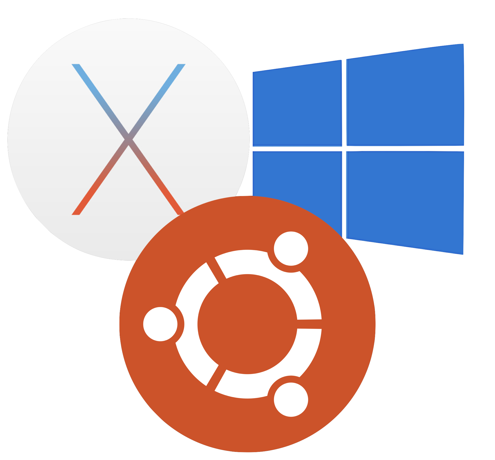

# DOM - Dotfile Organisation Manager
## The Dankest Dotfiles

Many of us have tapped into the chaotic good energy created from custom preferences, However keeping these bad bois consistent and shared between your work setups, virtual machines, raspberry pi, macbook, clusters, whatever Docker is, and the computer that you let your cat borrow in exchange for him doing the washing up, is not only challenging but damn frustrating when you can't rely on your beautiful alias's to do their job. 

So here collected, is a ubuntu/mac advanced developer setup for maintaining such a setup.

Your system crashes ---> a tear starts to trickle down your face as dark thoughts of setting up your system again enter your brain. A mental tally of the number of times you are going to have to write apt install begins to only be reminded every single time you do it that you forgot to write sudo. 

Swipe that misery away, reinstall from here and you will be frolicking with unicorns again.                                                                                           

